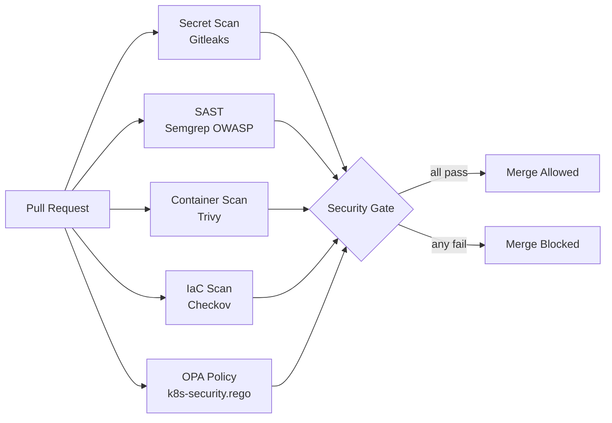

# fintech-security-hardening

> DevSecOps pipeline for fintech Kubernetes workloads — secret detection, SAST, container scanning, IaC security, and OPA policy enforcement as GitHub Actions security gates.

[](LICENSE)

---

## Security Gates

Every PR must pass all 5 gates before merge is allowed:

```
Secret Scan (Gitleaks) → SAST (Semgrep) → Container Scan (Trivy) → IaC Scan (Checkov) → OPA Policy Validation
```

All results upload to GitHub Security tab as SARIF — reviewable inline on the PR.

---

## Architecture



---

## OPA Policies Enforced

Every Kubernetes Deployment must:
- `runAsNonRoot: true`
- `allowPrivilegeEscalation: false`
- `readOnlyRootFilesystem: true`
- Define CPU and memory limits
- Define liveness and readiness probes
- Not use `:latest` image tag
- Not use `hostNetwork: true`
- Not run as privileged

Violations block the PR. No exceptions without a documented `.trivyignore` entry with expiry and approver.

---

## Local Usage

```bash
# Install pre-commit secret scanning hook
cp scripts/check-secrets.sh .git/hooks/pre-commit
chmod +x .git/hooks/pre-commit

# Validate your Kubernetes manifests locally before pushing
./scripts/validate-k8s-policies.sh ./apps

# Run Trivy filesystem scan locally
trivy fs . --config policies/trivy/trivy.yaml
```

---

## Design Decisions

**Gitleaks on full history (`fetch-depth: 0`)** — Scanning only the latest commit misses secrets committed and then "deleted" in a later commit. They're still in git history and fully recoverable. Full history scan catches these.

**SARIF upload to GitHub Security tab** — Results go to a single place every engineer already checks. No separate security dashboard to log into, no email reports nobody reads.

**OPA policies in Rego, not admission webhooks** — Admission webhooks are runtime enforcement. OPA in CI is shift-left enforcement — it catches violations before they're ever deployed, without needing cluster access in the pipeline.

**`.trivyignore` with mandatory metadata** — Blanket CVE ignores without documentation are how security debt accumulates silently. The ignore file format requires CVE ID, reason, expiry, and approver. CI removes undocumented ignores automatically.

---

## What I'd Do Differently at Scale

- **Kyverno or OPA Gatekeeper** as a second enforcement layer — CI catches things before deploy; admission control catches things that bypass CI (manual kubectl apply, misconfigured pipelines).
- **SBOM generation** — Trivy can generate SBOMs (Software Bill of Materials). Required for SOC2 Type II and increasingly for FedRAMP. Not wired up here yet.
- **Dependency review** — `actions/dependency-review-action` blocks PRs that introduce dependencies with known vulnerabilities. Complements Trivy.

---

## Author

**Mudassar Malek** — Senior DevOps / SRE Engineer | DevSecOps | Kubernetes | Fintech | AWS/Azure
